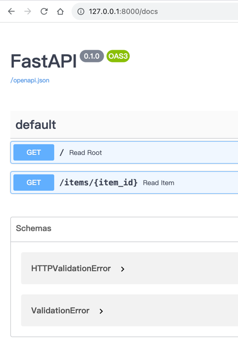
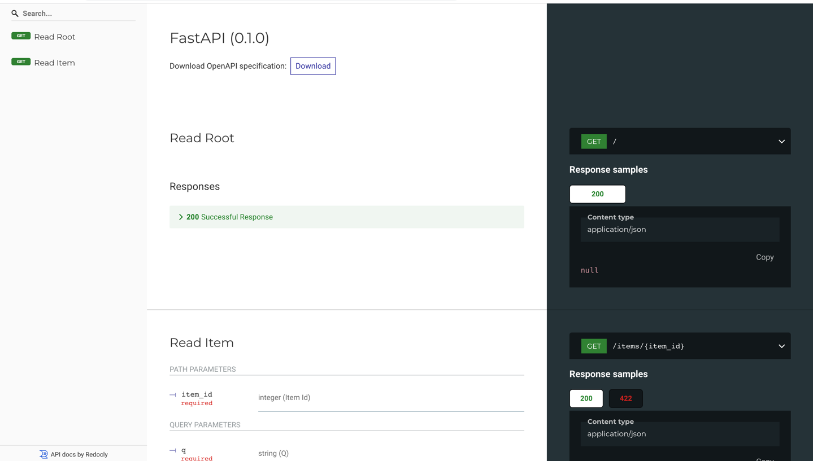

# Python

This is a simple fastapi web frame


### 创建代码库
GitHub创建一个Python仓库,这里命名为`fastapi`

### 拉取代码
将自己的代码库克隆到本地开发环境.替换自己的仓库名
```sql
git clone git@github.com:zjzjzjzj1874/fastapi.git
```

### 创建服务

#### 示例
* 创建主函数
创建一个名为`main.py`的函数并写入一下内容:
```python
from typing import Union

from fastapi import FastAPI

app = FastAPI()


@app.get("/")
def read_root():
    return {"Hello": "World"}


@app.get("/items/{item_id}")
def read_item(item_id: int, q: Union[str, None] = None):
    return {"item_id": item_id, "q": q}
```

* 启动项目
运行以下命令启动:
```shell
uvicorn main:app --reload
```
* 查看根路由:`http://0.0.0.0:8000`,输出以下内容:
```html
{
    "Hello": "World"
}
```
* 交互式API文档
  
  访问地址:`http://0.0.0.0:8000/docs`
  

* 可选API文档

  访问地址:`http://0.0.0.0:8000/redoc`
  

至此,我们已经成功创建了一个基于fastapi创建的python的web服务.
#### 示例升级
在`main.py`中添加一个`PUT`方法接收请求体,
先借助`Pydantic`来使用标准的Python类型申明请求体.
```python
from typing import Union

from fastapi import FastAPI
from pydantic import BaseModel

app = FastAPI()


class Item(BaseModel):
    name: str
    price: float
    is_offer: Union[bool, None] = None  # bool类型,默认None


@app.get("/")
def read_root():
    return {"Hello": "World"}


@app.get("/items/{item_id}")
def read_item(item_id: int, q: Union[str, None]):
    return {"item_id": item_id, "q": q}


@app.put("/items/{item_id}")
def update_item(item_id: int, item: Item):
    return {"item_name": item.name, "item_id": item_id}
```
服务器将会自动重载（因为在上面的步骤中你向 uvicorn 命令添加了 --reload 选项）。


### 添加管理依赖
* 创建虚拟环境
```shell
python3 -m venv venv_fastapi
```

* 激活虚拟环境
```shell
source venv_fastapi/bin/activate
```

* 安装fastapi
```shell
pip install fastapi
# 安装所有fastapi的依赖
```

* 写入依赖
```shell
pip freeze > requirements.txt
```
如果仅仅想追加依赖,使用以下命令:
```shell
pip freeze >> requirements.txt
```


### Todo list

* [x] 框架搭建
* [x] 依赖添加
* [ ] 部署